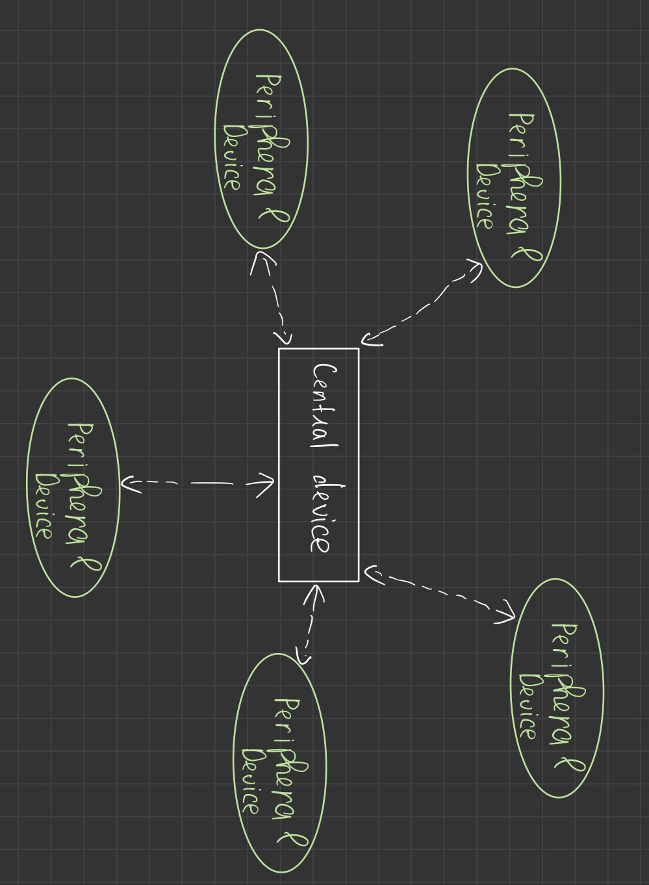
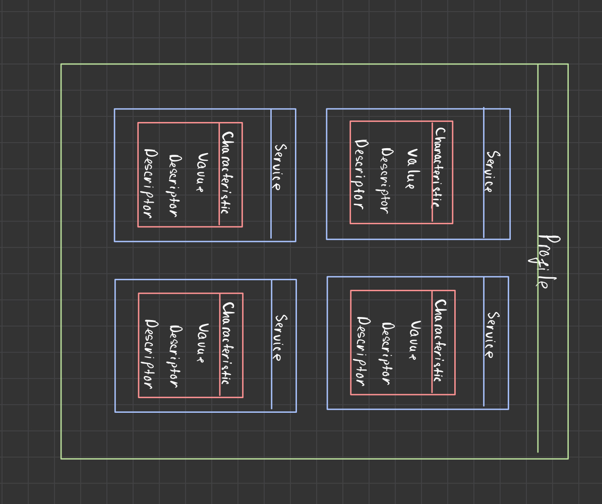

# IoT for baby (Tên này lấy cho kêu) phần 2
- Trong bài viết [trước](https://github.com/doctor-blue/prolearner-post/blob/master/IoT/Bluetooth/Ble_la_gi.md), mình đã giới thiệu với các bác về BLE là gì? Cũng như stack của nó.
- Còn hôm nay ta sẽ cùng tìm hiểu về GATT là một thành phần trong [Host Layer](https://github.com/doctor-blue/prolearner-post/blob/master/IoT/Bluetooth/Ble_la_gi.md#ble-stack), cấu trúc của nó để từ đấy làm nền tảng để hiểu cách giao tiếp với các thiết bị BLE khác.

## Các thành phần của GATT
- GATT định nghĩa cách hai thiết bị BLE truyền tải dữ liệu với nhau thông qua mô hình Client - Server. Sử dụng giao thức dữ liệu là ATT, bao gồm Services và Characteristic mỗi thành phần sẽ có một IDs 16-bit để định danh.

- Connection với GATT là loại ```Exclusive``` điều này có nghĩa với các thiết bị ngoại vi chỉ kết nối tới một thiết bị trung tâm (điện thoại, máy tính...) nhưng ngược lại một thiết bị trung tâm lại có thể kết nối tới nhiều thiết bị ngoại vi. Một lưu ý ở đây là một khi thiết bị ngoại vi được kết nối tới thiết bị trung tâm nó sẽ dừng việc ```advertising``` đồng nghĩa với việc thiết bị khác sẽ không nhìn thấy nó cho tới khi nó ngưng kết nối



- Như mình đã nói, GATT hoạt động dựa theo mô hình Client-Server. Thông thường GATT server là các thiết bị ngoại vi - nơi chưa dữ liệu và định nghĩa các services và characteristic, còn GATT Client (Điện thoại chẳng hạn) sẽ gửi request tới Server.
- Các bạn có thể xem chiếc ảnh do chính tay hoạ sĩ tài ba là mình vẽ ra ở bên dưới đây để thấy tổng thể của GATT.



- Từ ảnh trên mình sẽ cho các bạn định nghĩa về Service, Characteristic và một số thông tin nổi bật của chúng - những gì mà nãy giờ mình cứ luyên thuyên hoài.
- **Attributes**: Là thực thể nhỏ nhất được định nghĩa bởi GATT và ATT. Mỗi attribute sẽ chứa
    - ```Handle```: Số 16bit duy nhất trên mỗi Server để địa chỉ hoá attribute
    
    - ```Type```: Là kiểu UUID (Universal Unique Identifier), 16 bit - 32 bit - 128 bit duy nhất dùng để định danh.
    
    - ```Permission```: Xác định quyền thực thi trên các attribute cụ thể. Phần dưới đây mình sẽ nêu chi tiết về permission trong attribute.
       
        - Nếu các bạn biết về quyền truy cập tới các file trên máy tính của mình thì đối với GATT gần giống vậy. Với permission sẽ có thể xác định được Client có thể đọc(read) hay ghi(write) hay cả 2. Sẽ có các quyền sau:
            - ```None```: Client không thể đọc hoặc ghi
            - ```Readable```: Có thể đọc
            - ```Writeable```: Có thể ghi
            - ```Readable and Writeable```: Có thể vừa đọc vừa ghi.
    
        - File thì có thể có chủ sở hữu và muốn truy cập thì phải được xác thực xem có đúng là chủ sở hữu hay không thì mới cho phép mở. Cũng như vậy:
            - ```No authorization required```: Truy cập tới attribute mà không cần xác thực.
            -  ``` Authorization required```: Truy cập tới attribute bắt buộc phải xác thực.

        - File có thể mã hoá thì GATT cũng định nghĩa cách để chúng ta có thể làm vậy.
            - ```No encryption required```: Không mã hoá
            - ```Unauthenticated encryption required```: Kết nối cần được mã hoá để truy cập vào attribute nhưng khoá (key) không cần được xác thực.
            - ```Authenticated encryption required```: Kết nối cần được mã hoá và khoá cũng cần được xác thực.

    - ```Value```: Chứa dữ liệu có trong attribute, giới hạn 512 byte
 - **Service**: Là tập các thông tin, dữ liệu và hành động dùng để thực hiện một chức năng cụ thể. Có thể kể tới như Heart Rate (Nhịp tim), Battery (Pin)... Mỗi Service đều chứa ít nhất một ```Characteristic``` hoặc nhiều hơn và cũng có thể là tham chiếu tới một service khác.
 
- **Characteristic**: Chính là giá trị sử dụng trong Service, nơi chứa các thông tin, giá trị cũng như cách thức truy cập tới chúng (bảo mật, metadata của dữ liệu) 
     - ```Value:``` Dữ liệu của Characteristic
     - ```Descriptor:``` Chứa các thuộc tính, loại dữ liệu của characteristic và nơi tìm ra chúng 🐉 - các metadata của Characteristic.


## Lời cuối
- Trên đây mình là những khái niệm, những thành phần mà có lẽ các bạn sẽ cần hiểu khi bắt đầu mò mẫm về GATT của BLE. Từ những khái niệm này hi vọng sẽ giúp bạn hiểu hơn về cách thức các thiết bị BLE giao tiếp với nhau.
- Nếu các bạn thấy những bài viết của mình có ích hãy ủng hộ mình bằng bất cứ cách nào có thể dù chỉ là một star cho [Prolearners Project](https://github.com/doctor-blue/prolearners-site) cũng đủ để mình thấy vui cả ngày rồi!

    ```See u next time! Peace!!!```

