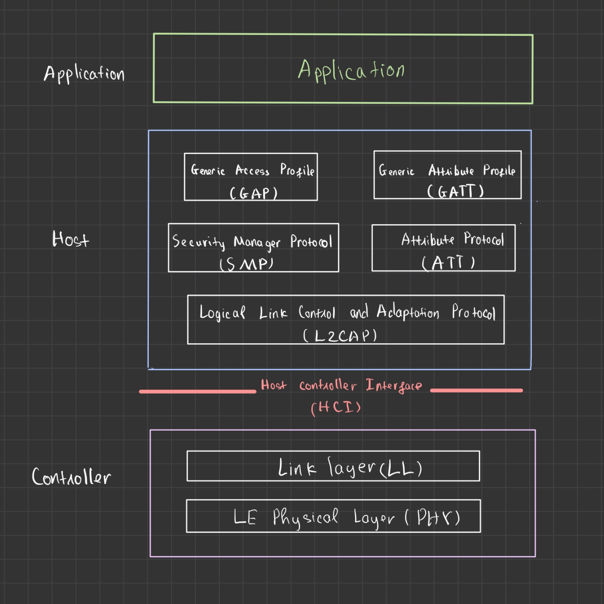

# IoT for baby (Tên này lấy cho kêu) phần 1

Cái tên thì cho Baby nhưng Baby này cũng phải to ra phết mới tiêu hoá được đống chữ này. Trong series này mình sẽ share những kiến thức mình lụm nhặt được trong quá trình làm việc với các thiết bị IoT. Cũng như giúp các bạn hiểu hơn IoT là gì, ứng dụng của nó, dùng những công nghệ nào. Cũng có thể không chỉ có lý thuyết xuông mà mình sẽ cố gắng tìm cách làm một vài ví dụ nếu có thể, nhưng có vẻ sẽ khó vì IoT cần kiến thức phần cứng mà mình lại chỉ là một thanh niên dev phần mềm đến dây LÓNG (L) và dây NẠNH (N) còn không phân biệt được 🤨. Hi vọng những bài viết của mình sẽ hữu ích và sẽ không quá ngán vì quá nhiều chữ và khái niệm, bởi khi đọc sẽ kiểu thấy chữ bay phấp phới nhảy múa tung tăng ấy 🙄🙄🥹.

Đề phòng kiểu gì cũng có bác hỏi tại sao không tạo cái blog mà đăng sao lại dùng file md thế này thì [đây](../../README.md) là lý do nhé ❤️‍🔥❤️‍🔥❤️‍🔥.

Để mở bát cho loạt bài ``IoT for baby`` mình sẽ giới thiệu đến các bạn chuẩn kết nối được dùng nhiều nhất gần đây cho các thiết bị IoT đó chính là Bluetooth cụ thể là BLE MESH. Nhưng trước tiên....

## Vậy Bluetooth là gì?

- Chắc hẳn ai cũng biết tới sự hiện diện của Bluetooth xung quanh chúng ta, đặc biệt trên các thiết bị di động. Nó là một chuẩn công nghệ truyền thông không dây tầm gần giữa các thiết bị điện tử. Công nghệ này hỗ trợ việc truyền dữ liệu qua các khoảng cách ngắn giữa các thiết bị di động và cố định, tạo nên các mạng cá nhân không dây. Bluetooth có thể đạt được tốc độ truyền dữ liệu 1Mb/s.

- Theo Bluetooth SIG(Bluetooth Special Interest Group), hiện có hơn 90% điện thoại smartphone có tính năng Bluetooth, bao gồm các hệ điều hành IOS, Android và Windows. Thêm nữa các thiết bị không dây đặc biệt là tai nghe đều sử dụng Bluetooth để truyền tải dữ liệu.
## BLE (Bluetooth low energy) - cũng là Bluetooth nhưng mà nó lạ lắm
- Ngày 30/6/2010 Bluetooth 4.0 ra đời cho phép truyền tải dữ liệu tốc độ cao nhờ vào Bluetooth High Speed và tiêu tốn năng lượng ít hơn nhờ Bluetooth Low Energy - BLE.
- Từ cái tên BLE cũng đã cho biết bản thân nó là gì. Nó là một công nghệ mạng không dây tiêu thụ rất ít năng lượng dùng để kết nối các thiết bị với nhau. Ban đầu công nghệ này được phát minh bởi [Nokia](https://vi.wikipedia.org/wiki/Nokia) vào năm 2006 với tên gọi Wibree, trước khi được **[Bluetooth Special Interest Group** (*Bluetooth SIG*)](http://en.wikipedia.org/wiki/Bluetooth_Special_Interest_Group) tích hợp vào Bluetooth 4.0 như mình đã nói ở trên. Mục tiêu chính của việc tích hợp là **tối ưu hóa mức năng lượng tiêu thụ**.
- BLE không được xem là bản nâng cấp của Bluetooth thông thường, nó là một công nghệ mới tập trung vào IoT - những thiết bị có ít dữ liệu được truyền đi ở tốc độ thấp.
- Khi quét, các thiết bị BLE được phát hiện thông qua một quy trình dựa trên việc phát đi các gói quảng cáo (Advertising packets). Điều này được thực hiện bằng cách gửi một gói tin trên ít nhất một trong 3 channel riêng biệt và lặp đi lặp lại trong một khoảng thời gian với độ trễ ngẫu nhiên lên tới 10ms (10 mili giây).
## BLE và Bluetooth Classic
 Về cơ bản chúng có sự khác nhau mà mình đề cập ở dưới đây
| | Classic | BLE|
|---|---| ---|
|Tần số vô tuyến| 2.4GHz (2.400–2.4835 GHz) | 2.4GHz (2.400–2.4835 GHz)|
| Channels | 79 1-MHz | 40 2-MHz|
| Khoảng cách (lý thuyết) |  Up to 100m | <100m |
| Tốc độ | 1-3Mbps | 1Mbps |
| Bảo mật | 64-bit, 128-bit | 128-bit AES |
|Mức tiêu thụ năng lượng| Thấp (1W làm tham chiếu) | Cực kỳ thấp (0.01–0.50 W)|


## BLE Stack

Mình sẽ mô tả Stack của BLE thông qua hình bên dưới (Chữ mình hơi xấu nên các bác thông cảm 🥲)



- **Application Layer**: Lớp ứng dụng - là lớp tường tác trực tiếp với người dùng. Chứa giao diện, logic và kiến trúc ứng dụng chung.
- **Host Layer**: Là lớp theo sau Application gồm nhiều cấu trúc khác nhau.
    - **Generic Access Profile (GAP)**: Phần này mô tả cách các thiết bị BLE giao tiếp với nhau. Có thể hiểu nó như một bộ phận chịu trách nhiệm
    cách các thiết bị phát hiện ra nhau để giao tiếp.
    - **Generic Attribute Profile (GATT)** Phần này gần giống với GAP, mô tả cách các thuộc tính được định dạng, đóng gói và chuyển giao tới thiết bị được kết nối. Được Application sử dụng cho hoạt động trao đổi thông tin theo dạng Client - Server. (Phần này mình sẽ dành riêng để chi tiết hơn trong bài viết tiếp theo)
    - **Attribute Protocal (ATT)**: Đây là nơi cấu hình các quy tắc về cách GATT hoạt động, quy định thiết bị đang là Client hay Server. Server chứa dữ liệu tổ chức thành các attribute. Mỗi attribute lại bao gồm 16-bit handler, một UUID định danh, một giá trị(value) và tập các permission.
    - **Security Manager Protocol (SMP)** Thành phần này giúp đảm bảo sự bảo mật giữa hai hay nhiều thiết bị. 
    - **Logical Link Control and Adaption Protocol (L2CAP)** Các gói tin thông qua thành phần này sẽ được đóng gói thành các gói BLE tiêu chuẩn bằng cách chuyển đổi các giao thức. Đồng thời đối với những gói tin lớn nó sẽ tách nhỏ hoặc kết hợp để tái tạo gói tin.
-**Host Controller Interface (HCI)**: Lớp trung gian chịu trách nhiệm vận chuyển các lệnh, sự kiện giữa host và controller. Lớp này đươc triển khai thông qua một số giao thức như SPI hoặc UART. 
- **Controller Layer** Tầng điều khiển - là bộ phần phần cứng của kiến trúc BLE đảm bảo thực hiển các chức năng được xác định như quét(scan), quảng bá(adverises), giao tiếp giữa các thiết bị. 


## Kết
- Mình biết đống chữ trên có vẻ hơi tởm nhưng mà mình đang cố gắng tìm cách để nó trở nên dễ hiểu hơn nữa cho đúng với tên gọi ```IoT for baby```, bởi đến mình cũng thấy đống chữ này đáng sợ mà 🌚🌚🌚.
- Nếu các bạn thấy những bài viết của mình có ích hãy ủng hộ mình bằng bất cứ cách nào có thể dù chỉ là một star cho [Prolearners Project](https://github.com/doctor-blue/prolearners-site) cũng đủ để mình thấy vui cả ngày rồi!

    ```See u next time! Peace!!!```