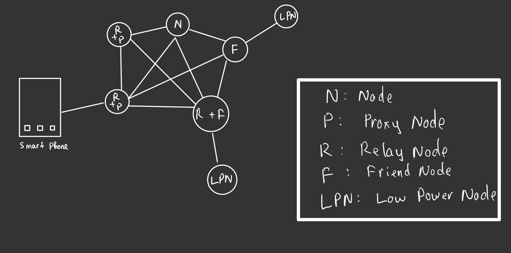

# IoT for baby (Tên này lấy cho kêu) phần 3 - BLE MESH
- Những bài viết trước mình đã giới thiệu với các bác về ble là gì? Các thành phần cấu tạo của nó, để từ đó mang các bạn đến với BLUETOOTH MESH một chuẩn kết nối mạng không dây đang phổ biến trong những năm gần đây
đặc biệt trong ngành IoT (Internet of Things).

## Giới thiệu
- Bluetooth Mesh là một công nghệ Bluetooth được công bố bởi Bluetooth SIG (Bluetooth Special Interest Group) công bố vào năm 2017. Là một Flood network, cho phép kết nối 
many-many tức nhiều nhiều thay vì kết nối one-one (1-1) hay one-many như Bluetooth tiêu chuẩn và được tối ưu hoá để tạo thành mạng lưới thiết bị quy mô lớn.


## Đặc điểm của BLE MESH
- Không giống với Bluetooth thông thường cần phải connect với nhau để truyền dữ liệu Ble mesh hoạt động dựa trên cơ chế Advertising - Scanning để chuyển tiếp các gói tin cho nhau với khoảng cách lên tới 10 mét. Và như mình đã nói Ble mesh là một ```Flood network```điều này có nghĩa là khi một thiết bị nhận được gói tin nó sẽ chuyển tiếp tới các thiết bị khác trong mạng cho tới khi đến được thiết bị đích. Các bạn có thể nhìn hình bên dưới đây:


Đó các bác thấy chứ tại hình bên phải khi gói tin được gửi vào mạng để tới thiết bị đích thì bản tin sẽ được gửi đi một cách vô điều kiện cho tới khi đến được nơi cần đến. Các bạn có thể tưởng tượng tới việc cùng một lệnh - gói tin được gửi tới thiết bị đích nhiều lần thì mesh đã có cơ chế kiểm soát vấn đề này thông qua việc caching hay TTL (time to live)

- Mỗi thiết bị trong mạng sẽ được coi là một ```Node``` bao gồm: 
    - **Relay Node:** Đây là tính năng cho phép một Node có thể nhận và chuyển tiếp tin nhắntrong mạng BLE Mesh, giúp mở rộng phạm vi hoạt động của mạng.
    - **Proxy Node:** Phần lớn tất cả các thiết bị di động hiện nay không hề hỗ trợ Ble Mesh cho nên trong mạng sẽ cần một thiết bị - Node trung gian và đó chính là nhiệm vụ của Proxy Node.
    - **Low Power Node:** Là những thiết bị hoạt động ở mức năng lượng thấp và trong hầu hết thời gian chúng sẽ thực hiện ngủ sâu như các cảm biến chạy pin chẳng hạn , chỉ thức dậy để gửi gói tin khi cần (cụ thể có thể kể tới là khi có tác động từ người dùng). Đối với LPN bắt buộc phải cần có một ```Friend node``` để duy trì hoạt động, khi thức dậy sau một khoảng thời gian LPN sẽ lấy dữ liệu từ bộ nhớ hoặc chuyển gói tin bất kì vào mạng thống qua ```Friend Node```
    - **Friend Node:** Đây là một thiết bị luôn được cấp nguồn để hoạt động và như đã đề cập ở trên nó có nhiệm vụ hỗ trợ các thiết bị LPN để chúng có thể hoạt động ở chế độ tiết kiệm năng lượng.



### Element
- Mỗi nút (node) trong mạng lưới có thể có nhiều yêu cầu khác nhau, tính năng khác nhau và Bluetooth Mesh cho phép mỗi nút có thêm các element để thực hiện chúng. Điều này nghĩa là sao? Một mạng chúng ta có nhiều Node và mỗi Node chúng ta lại có thể có nhiều Element. Nó cũng đồng nghĩa với việc một thiết bị đèn cũng có thể có khả năng thông báo nhiệt độ, độ ẩm. Vi diệu đúng không?

- Mỗi element trong một nút có một địa chỉ duy nhất, được gọi là unicast address. Thông qua các địa chỉ unicast này, ta có thể kiểm soát các element của một nút một cách độc lập. Theo thông số kỹ thuật của Bluetooth Mesh, một element là một thực thể có thể định địa chỉ trong một nút.

### Giao tiếp với mạng Bluetooth Mesh

Như mình đã nói ở trên các thiết bị di động thông minh hiện nay hầu hết không hỗ trợ Bluetooth Mesh và nếu muốn gửi và nhận dữ liệu trong mạng từ thiết bị di động chúng ta sẽ thông qua một **Proxy Node** trong mạng.

Có 2 cách để chúng ta thực hiện công cuộc nói chuyện này:
- **AVD Bearer**: Sử dụng trạng thái quảng cáo (advertising) của thiết bị BLE để gửi và nhận message.Khi một thiết bị BLE quảng cáo, nó sẽ gửi định kỳ các gói dữ liệu mà các thiết bị lân cận có thể phát hiện và xử lý. Thông báo được gửi bởi người mang ADV có thể được nhận bởi nhiều nút đồng thời. AVD dựa trên GAP (Generic Access Profile) và sử dụng một loại advertising đặc biệt gọi là Undirected Advertising (quảng cáo vô hướng?) không thể kết nối và không thể quét được (non-connectable and non-scannable).
- **GATT Bearer**: Gửi và nhận dữ liệu dựa trên cấu trúc point-to-point và bắt buộc phải thiết lập kết nối. Gần như tất cả các thiết bị di động thông minh đều hỗ trợ BLE và chúng có thể giao tiếp với các Proxy Node qua GATT

Từ đây chúng ta có thể suy ra với các thiết bị ví dụ như cảm biến cũ dựa trên Bluetooth 4.0 cũng có thể giao tiếp với các Proxy Node.

## Lời cuối
- Trên đây mình đã nêu lên những khái niệm, đặc điểm, và phần nào cách thức hoạt động của Bluetooth Mesh. Hi vọng thông qua bài viết này có thể giúp các bạn có thêm một chút nữa kiến thức về thế giới IoT :v
- Nếu các bạn thấy những bài viết của mình có ích hãy ủng hộ mình bằng bất cứ cách nào có thể dù chỉ là một star cho [Prolearners Project](https://github.com/doctor-blue/prolearners-site) cũng đủ để mình thấy vui cả ngày rồi!

    ```See u next time! Peace!!!```